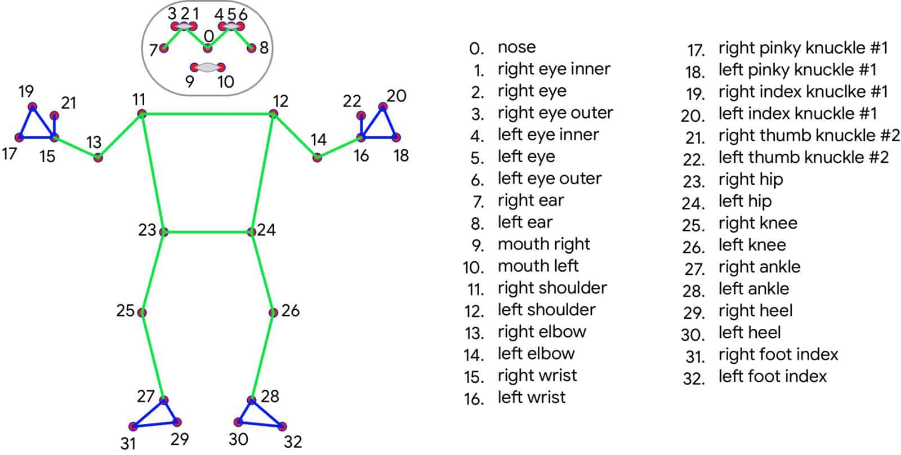

# Ailetics 💪🏻

## Introduction and Objectives 🎯
Our proposed project takes advantages of AI technology, including Python, Mediapipe, TensorFlow, and LSTM, o develop a personal trainer capable of detecting exercise form and ensures that it is correct. With a very high testing accuracy, our system enhances fitness routines by providing real-time feedback. This report explores our tools, results, and future expansion plans.

## Team Members and Tasks 👥
|Task |Khalid Alhumaidan | Rakan Almuwainie | Anwar Almutlaq | Abdullah Alowayyid
|-|-|-|-|-
|Business Problem|✌|✌|✌ |✌
|Data Modeling|✌|✌|✌|✌
|Training The Model|✌ |✌ |✌|✌
|Calculate Angles|✌| ✌||✌
|Visualize Angles |✌| ✌|✌|✌
|Model Evaluation|✌|✌|✌ |✌
|Model Re-Evaluation|✌||✌|✌
|Model Deployment|✌|✌|✌|✌
|Website Front-end|||✌|
|Website Back-end|✌ |✌ |✌|✌
|Create Dashboard|✌|| |
|Presentation|✌|✌|✌ |✌
|Creating README|✌|✌|✌ |✌


## Dataset Overview 📑

The dataset contains x,y coordinates of each point in the body as shown in the figure, and then, the LSTM model receives them and a label for which exercise it is. It does not need any cleaning and preprocessing.



## Model

The model is sequential from tensorflow, It consists of 3 LSTM layers with relu activation functions, then 2 Dense layers with relu also, and the output layer is a softmax with three classes. Here is the model summary.
```
Model: "sequential"
_________________________________________________________________
 Layer (type)                Output Shape              Param #   
=================================================================
 lstm (LSTM)                 (None, 30, 128)           133632    
                                                                 
 lstm_1 (LSTM)               (None, 30, 256)           394240    
                                                                 
 lstm_2 (LSTM)               (None, 128)               197120    
                                                                 
 dense (Dense)               (None, 128)               16512     
                                                                 
 dense_1 (Dense)             (None, 64)                8256      
                                                                 
 dense_2 (Dense)             (None, 3)                 195       
                                                                 
=================================================================
Total params: 749,955
Trainable params: 749,955
Non-trainable params: 0
_________________________________________________________________
None
```
##  Results


https://github.com/Khalid-Ibrahim1/Capstone-Project/assets/74132986/52cb817b-cb00-428c-9972-a4f83d484e83


As you can see in the video, the model was able to detect all of the exercises, the correct and incorrect. So we can say that its accuracy is 100% :)
